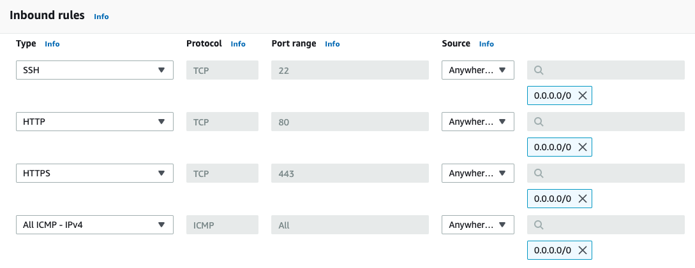
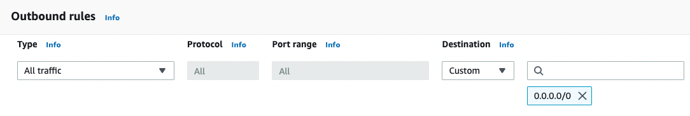
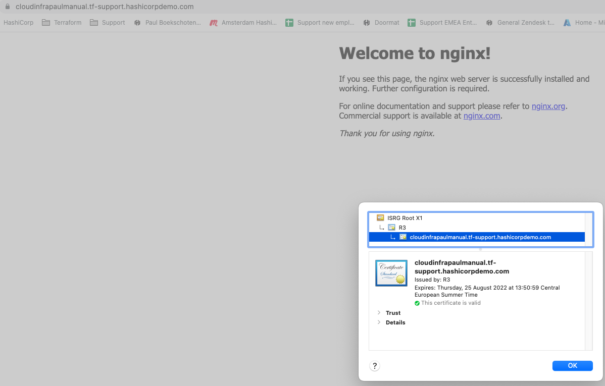

on AWS  
create EC2 instance with Public IP on it  
add security group for ssh, ICMP (ping) and http/https  
create fqdn dns entry on domain (use one available on r53, no need to buy one)  
get a valid ssl cert for dns entry  
configure a nginx web  
test certificate works - on a desktop browser padlock closes  


Region: eu-west-3

# Key pair
Go to Key Pairs  
Create key pair  
  Name: paul-manual  
  Type: RSA  
  Format: .pem

Save the pem downloaded by the browser.  
chmod it to 0600  

# Security group
Go to security groups  
Create security group
  Name: paul-sg-manual  
  Description: http(s), ssh, icmp
  Add inbound rules:  


  Make sure outbound rule is present.  


# EC2 instance with public IP
Go to EC2 instances  
Click Launch instances  
  Name: paul-manual-web
  Select Ubuntu 22.04 LTS 64-bit x86 (ami-0042da0ea9ad6dd83)  
  Instance type: t2.micro  
  Key pair: select paul-manual
  Under Network Settings, click edit, select existing security group -> paul-sg-manual  

## Connect to EC2
SSH: ssh -i ../paul-manual.pem ubuntu@35.180.131.222  

# DNS
Go to Route 53  
Go to hosted zones  
Go to tf-support.hashicorpdemo.com  
Create record  
  Record name: cloudinfrapaulmanual  
  Record type: A
  Value: 35.180.131.222  

# certificate
Login to the machine with SSH  
Install certbot
```
sudo apt-get update
sudo apt-get install -y certbot
```

Get certificate  
```
sudo certbot -d cloudinfrapaulmanual.tf-support.hashicorpdemo.com --manual --preferred-challenges dns certonly --register-unsafely-without-email
```
Accept the Terms of Service  

```
Please deploy a DNS TXT record under the name:

_acme-challenge.cloudinfrapaulmanual.tf-support.hashicorpdemo.com.

with the following value:

pIJN3iMj4A9Ln23ES0vdMQFku7vmbCIA0jdkuM64aTQ

Before continuing, verify the TXT record has been deployed. Depending on the DNS
provider, this may take some time, from a few seconds to multiple minutes. You can
check if it has finished deploying with aid of online tools, such as the Google
Admin Toolbox: https://toolbox.googleapps.com/apps/dig/#TXT/_acme-challenge.cloudinfrapaulmanual.tf-support.hashicorpdemo.com.
Look for one or more bolded line(s) below the line ';ANSWER'. It should show the
value(s) you've just added.
``` 
Do this like creating the A record, instead choose TXT for type.  
Note: the domain contains an extra _acme-challenge part.  

Check if record is OK  
```
dig TXT _acme-challenge.cloudinfrapaulmanual.tf-support.hashicorpdemo.com

; <<>> DiG 9.10.6 <<>> TXT _acme-challenge.cloudinfrapaulmanual.tf-support.hashicorpdemo.com
;; global options: +cmd
;; Got answer:
;; ->>HEADER<<- opcode: QUERY, status: NOERROR, id: 6888
;; flags: qr rd ra; QUERY: 1, ANSWER: 1, AUTHORITY: 0, ADDITIONAL: 1

;; OPT PSEUDOSECTION:
; EDNS: version: 0, flags:; udp: 512
;; QUESTION SECTION:
;_acme-challenge.cloudinfrapaulmanual.tf-support.hashicorpdemo.com. IN TXT

;; ANSWER SECTION:
_acme-challenge.cloudinfrapaulmanual.tf-support.hashicorpdemo.com. 300 IN TXT "pIJN3iMj4A9Ln23ES0vdMQFku7vmbCIA0jdkuM64aTQ"

;; Query time: 39 msec
;; SERVER: 213.46.228.196#53(213.46.228.196)
;; WHEN: Fri May 27 14:50:14 CEST 2022
;; MSG SIZE  rcvd: 150
```

Return to certbot and continue.  
```
Successfully received certificate.
Certificate is saved at: /etc/letsencrypt/live/cloudinfrapaulmanual.tf-support.hashicorpdemo.com/fullchain.pem
Key is saved at:         /etc/letsencrypt/live/cloudinfrapaulmanual.tf-support.hashicorpdemo.com/privkey.pem
This certificate expires on 2022-08-25.
These files will be updated when the certificate renews.

NEXT STEPS:
- This certificate will not be renewed automatically. Autorenewal of --manual certificates requires the use of an authentication hook script (--manual-auth-hook) but one was not provided. To renew this certificate, repeat this same certbot command before the certificate's expiry date.
```

# nginx
Install  
```
sudo apt-get install -y nginx
```

Configure  
```
sudo vi /etc/nginx/sites-enabled/default
```

Replace the contents with below 
```conf
# Default server configuration
server {
	listen 80 default_server;
	listen [::]:80 default_server;

	# SSL configuration
	#
	listen 443 ssl default_server;
	listen [::]:443 ssl default_server;

	ssl_certificate /etc/letsencrypt/live/cloudinfrapaulmanual.tf-support.hashicorpdemo.com/fullchain.pem; # managed by Certbot
	ssl_certificate_key /etc/letsencrypt/live/cloudinfrapaulmanual.tf-support.hashicorpdemo.com/privkey.pem; # managed by Certbot

	root /var/www/html;
	index index.html index.htm index.nginx-debian.html;
	server_name _;

	location / {
		# First attempt to serve request as file, then
		# as directory, then fall back to displaying a 404.
		try_files $uri $uri/ =404;
	}
}
```

```
sudo service nginx restart
```

Ga naar [https://cloudinfrapaulmanual.tf-support.hashicorpdemo.com/](https://cloudinfrapaulmanual.tf-support.hashicorpdemo.com/)

En bekijk het certificaat.  
